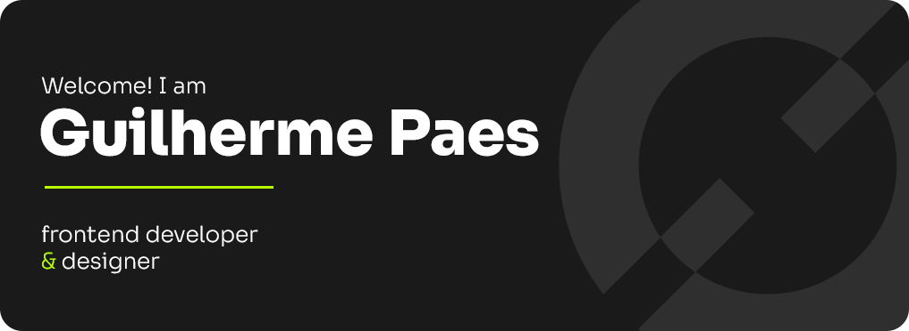

 

My name is Guilherme Paes. I have been working as a designer since 2017, and since 2022, I have been learning about frontend development, seeking to combine my experience to create attractive and accessible designs for a better web.
  
These are some of technologies that I've already learned:

